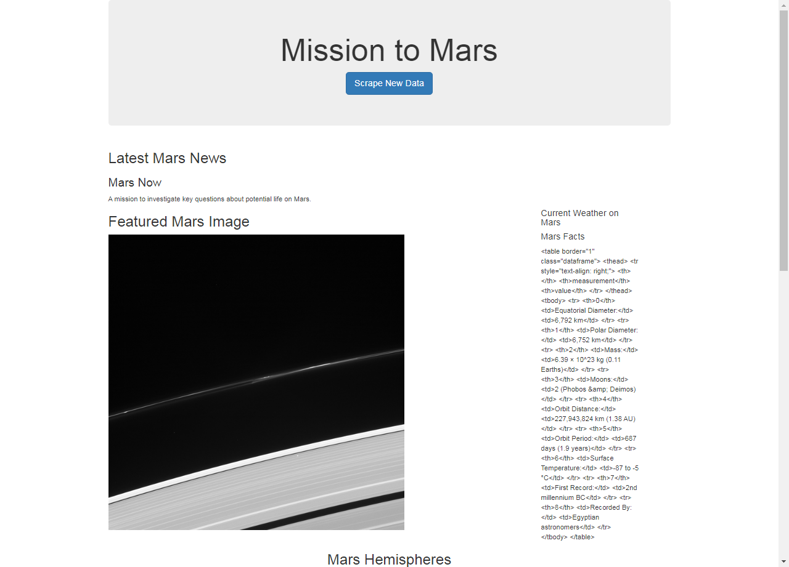
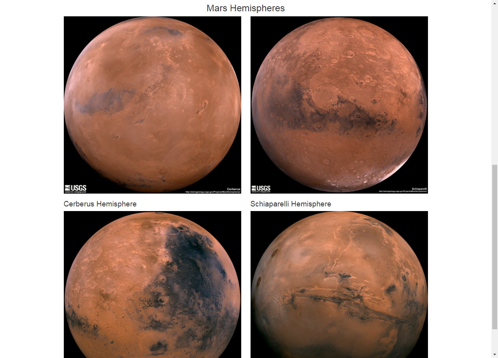
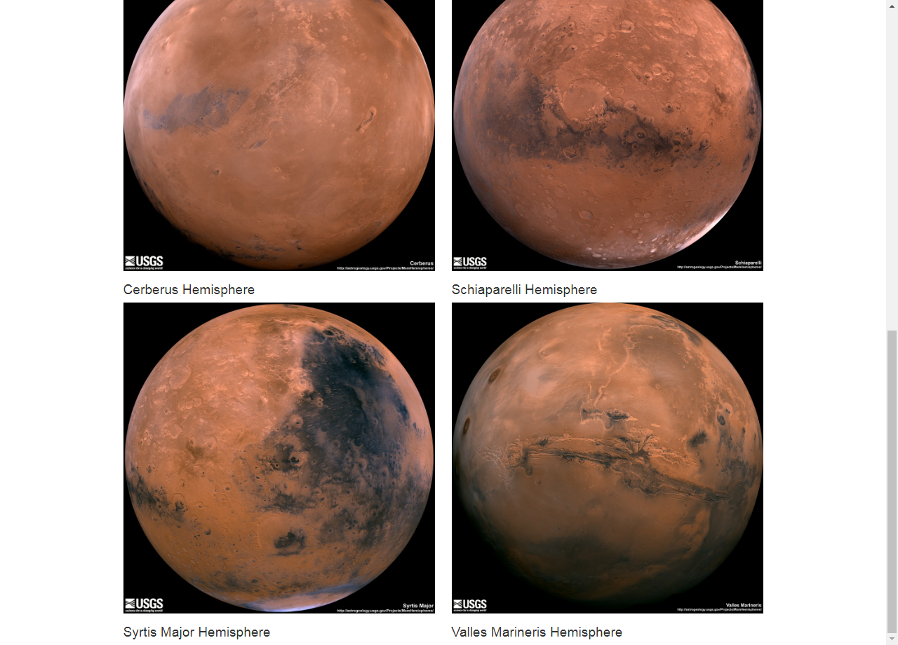
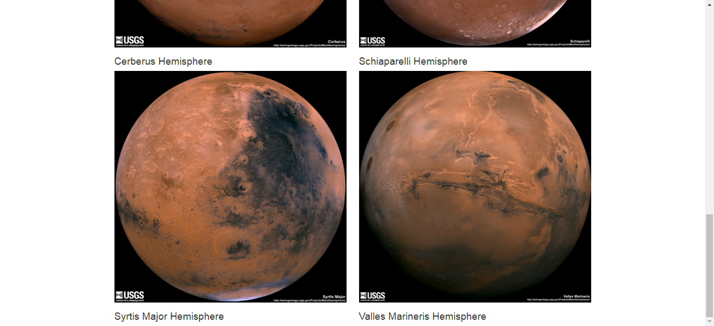

# Project Background

You will build a web application that scrapes various websites for data related to the Mission to Mars and displays the information in a single HTML page.

### Steps done:

1. Complete your initial scraping using Jupyter Notebook, BeautifulSoup, Pandas, Requests/Splinter, Selenium, and Python modules for regular expressions and time.
2. Use MongoDB with Flask templating to create a new HTML page (using Bootstrap) that displays all of the information that was scraped from the various URLs related to the Mission to Mars.

## Missions_to_Mars folder contains:

* mission_to_mars.ipynb jupyter notebook
* app.py
* scrape_mars.py
* templates folder
  * index.html
* Screenshots of final application
  * screenshot_final_application_1.png
  * screenshot_final_application_2.png
  * screenshot_final_application_3.png
  * screenshot_final_application_4.png

## Screenshots of Final Application

Screenshot 1

Screenshot 2

Screenshot 3

Screenshot 4

